# ArchiMate 2025 färger i ordning

Nedan visas ArchiMate-delarna i den ordning som ska användas i dokumentet och diagrammet.

## Färgkoder per ArchiMate-del

| Färgikon | Färgnamn | HEX-kod | ArchiMate-del |
|---|---|---|---|
|  | Languid Lavender | `#D8C1E4` | Motivation elements |
|  | Saffron Mango | `#EFBD5D` | Strategy elements |
|  | Jasmine | `#F4DE7F` | Business elements |
|  | Pale Aqua | `#B6D7E1` | Application elements |
|  | Fringy Flower | `#C3E1B4` | Technology elements |
|  | Satin Linen | `#E8E5D3` | Composite elements / Location |
|  | Tea Rose | `#F8C2BE` | Implementation & Migration elements |

## Ordning och färger

| ArchiMate-del | Exempel på innehåll | Färgkod |
|---|---|---|
| Motivation | Goal, Stakeholder, Requirement | `#D8C1E4` |
| Strategy | Capability, Resource, Course of Action | `#EFBD5D` |
| Business | Business Process, Business Service, Business Actor | `#F4DE7F` |
| Application | Application Service, Application Component, Data Object | `#B6D7E1` |
| Technology | Technology Service, Node, Artifact | `#C3E1B4` |
| Composite / Location | Location, Grouping | `#E8E5D3` |
| Implementation & Migration | Work Package, Deliverable, Gap | `#F8C2BE` |

## Mermaid

```mermaid
flowchart TD
    subgraph Motivation["Motivation"]
        M1[Goal]:::motivation
        M2[Stakeholder]:::motivation
        M3[Requirement]:::motivation
    end

    subgraph Strategy["Strategy"]
        S1[Capability]:::strategy
        S2[Resource]:::strategy
        S3[Course of Action]:::strategy
    end

    subgraph Business["Business"]
        B1[Business Process]:::business
        B2[Business Service]:::business
        B3[Business Actor]:::business
    end

    subgraph Application["Application"]
        A1[Application Service]:::application
        A2[Application Component]:::application
        A3[Data Object]:::application
    end

    subgraph Technology["Technology"]
        T1[Technology Service]:::technology
        T2[Node]:::technology
        T3[Artifact]:::technology
    end

    subgraph Composite["Composite / Location"]
        C1[Location]:::composite
        C2[Grouping]:::composite
    end

    subgraph Implementation["Implementation & Migration"]
        I1[Work Package]:::implementation
        I2[Deliverable]:::implementation
        I3[Gap]:::implementation
    end

    Motivation --> Strategy --> Business --> Application --> Technology --> Composite --> Implementation

    classDef motivation fill:#D8C1E4,stroke:#D8C1E4,stroke-width:2px,color:#000;
    classDef strategy fill:#EFBD5D,stroke:#EFBD5D,stroke-width:2px,color:#000;
    classDef business fill:#F4DE7F,stroke:#F4DE7F,stroke-width:2px,color:#000;
    classDef application fill:#B6D7E1,stroke:#B6D7E1,stroke-width:2px,color:#000;
    classDef technology fill:#C3E1B4,stroke:#C3E1B4,stroke-width:2px,color:#000;
    classDef composite fill:#E8E5D3,stroke:#E8E5D3,stroke-width:2px,color:#000;
    classDef implementation fill:#F8C2BE,stroke:#F8C2BE,stroke-width:2px,color:#000;
```

## Kort instruktion

- Börja med Motivation för att beskriva drivkrafter, mål och krav.
- Fortsätt med Strategy för att visa förmågor och vägval.
- Beskriv sedan Business, Application och Technology i fallande ordning.
- Lägg Composite / Location som stödjande gruppering där det behövs.
- Avsluta med Implementation & Migration för förändringsarbetet.