# ArchiMate 4 (C260) Modern Color Set för Mermaid (svenska)

Denna skill används för att generera Mermaid-diagram som följer ArchiMate 4 (C260) Modern Color Set med svenska termer, fasta domänfärger och konsekvent notation. Fokus ligger på Mermaid-diagram, men skillen innehåller även riktlinjer för HTML-inbäddning när det behövs för bättre textstyling.

## Syfte

Använd denna skill när användaren vill:

- skapa ArchiMate-diagram i Mermaid
- få korrekta ArchiMate 4-färger
- visualisera domäner som Motivation, Strategy, Common, Business, Application och Technology
- göra förmågekartor, värdeströmmar, integrationskartor eller migrationsplaner
- få all text på svenska med ArchiMate-liknande stereotyper

## Obligatoriska regler

Följ alltid dessa regler:

1. Använd alltid exakt ArchiMate 4-palett, aldrig ungefärliga färger.
2. Allt innehåll ska vara på svenska.
3. Elementtyp ska alltid visas i guillemets: `«typ»`.
4. Stereotypen ska alltid stå på egen rad ovanför elementnamnet. Undantag: i `gantt` och `timeline` ska stereotyp inte visas.
5. Domänordningen ska hållas: Motivation → Strategy → Common → Business → Application → Technology → Implementation & Migration.
6. Text på färgade noder ska vara mörk (`#000000` eller `#1a1a1a`), aldrig vit.
7. Strategy-domänen ska användas när förmågor, resurser, värdeströmmar eller handlingsplaner modelleras.
8. Common-domänen (ny i AM4) används för generiska beteendeelement (process, funktion, tjänst, händelse) som inte tillhör en specifik domän.
9. Physical Layer finns inte i AM4. Fysiska element (utrustning, anläggning, material) ingår i Technology-domänen.
10. Stereotypen ska vara **kursiv**. Om renderaren stöder markdown/html labels ska stereotypen också vara mindre och grå.

## Färgpalett

| Domän | Fyllning | Kontur | Typiska element |
|---|---|---|---|
| Motivation | `#D8C1E4` | `#B39BCF` | «intressent», «drivkraft», «bedömning», «mål», «princip», «krav», «värde» |
| Strategy | `#EFBD5D` | `#D4A43B` | «resurs», «förmåga», «värdeström», «handlingsplan» |
| Common | `#E8E5D3` | `#C4BFA6` | «process», «funktion», «tjänst», «händelse», «kollaboration», «roll», «interaktion» |
| Business | `#F4DE7F` | `#E8C555` | «aktör», «roll», «samarbete», «gränssnitt», «affärsobjekt», «produkt» |
| Application | `#B6D7E1` | `#8CC5D4` | «komponent», «samarbete», «gränssnitt», «dataobjekt» |
| Technology | `#C3E1B4` | `#9BD083` | «nod», «enhet», «systemprogramvara», «nätverk», «kommunikationsväg», «tjänst», «artefakt», «utrustning», «anläggning» |
| Implementation & Migration | `#F8C2BE` | `#F09B95` | «arbetspaket», «leverans», «platå» |

## Domäner i detalj

Varje domän med färg, ikon, syfte och typiska elementtyper.

### 💡 Motivationsdomän — `#D8C1E4` / `#B39BCF`

**Varför:** Representerar mål, drivkrafter, krav och principer som motiverar arkitekturbeslut. Placerad i centrum av AM4-hexagonen — all arkitektur börjar här.

Typiska element: «intressent», «drivkraft», «bedömning», «mål», «utfall», «princip», «krav», «betydelse», «värde».

### 🎯 Strategidomän — `#EFBD5D` / `#D4A43B`

**Hur:** Representerar förmågor, resurser och handlingsplaner. Bryggan mellan motivationen och den operativa verksamheten.

Typiska element: «resurs», «förmåga», «värdeström», «handlingsplan».

### 🔗 Common-domän — `#E8E5D3` / `#C4BFA6` *(ny i AM4)*

**Delade element:** Generiska beteendeelement som delas av alla domäner. I AM3.2 duplicerades dessa per lager (BusinessProcess, ApplicationProcess, TechnologyProcess). I AM4 finns de bara en gång i Common.

Typiska element: «process», «funktion», «tjänst», «händelse», «kollaboration», «roll», «interaktion», «stig».

### 💼 Verksamhetsdomän — `#F4DE7F` / `#E8C555`

**Affär:** Representerar aktörer, roller och värdeskapande mot kunder. Beteenden (process, tjänst) ärvs från Common-domänen.

Typiska element: «aktör», «roll», «samarbete», «gränssnitt», «affärsobjekt», «produkt».

### 💻 Applikationsdomän — `#B6D7E1` / `#8CC5D4`

**IT-stöd:** Representerar applikationskomponenter, gränssnitt och dataobjekt. Beteenden ärvs från Common-domänen.

Typiska element: «komponent», «samarbete», «gränssnitt», «dataobjekt».

### 🖥️ Teknologidomän — `#C3E1B4` / `#9BD083`

**Infrastruktur & OT:** Representerar IT-infrastruktur och fysisk operativ teknik. Physical Layer från AM3.2 är nu inbakat här — utrustning, anläggningar och material hör hit.

Typiska element: «nod», «enhet», «systemprogramvara», «samarbete», «gränssnitt», «nätverk», «kommunikationsväg», «tjänst», «artefakt», «utrustning», «anläggning», «material».

### 📋 Implementation & Migration — `#F8C2BE` / `#F09B95`

**Förändring:** Representerar program, projekt, arbetspaket, leveranser och platåer i en transformationsresa.

Typiska element: «arbetspaket», «leverans», «platå».

## Visuell standard för stereotyp-rad

Stereotyp-raden, till exempel `«process»`, ska följa denna målbild:

- kursiv stil
- mindre storlek än elementnamnet, cirka `0.75em`
- grå färg, helst `#555555`
- egen rad ovanför elementnamnet

## Viktigt om Mermaid-stöd

Mermaid kan hantera kursiv stil i etiketter när markdown strings eller HTML-baserade etiketter stöds av renderaren. Däremot är separat fontstorlek och separat färg för just första raden i samma nod inte alltid portabelt i ren Mermaid.

Därför gäller följande prioritet:

1. **Förstahandsval:** använd kursiv stereotyp via markdown eller HTML i nodetiketten.
2. **Andrahandsval:** använd radbrytning så att stereotypen åtminstone visas på egen rad ovanför namnet.
3. **När HTML/CSS runt Mermaid är möjligt:** använd CSS eller HTML-labels för att göra stereotypen mindre och grå.

## Rekommenderad Mermaid-init

Använd denna init när renderaren stöder moderna Mermaid-funktioner:

```text
%%{init: {
  "theme": "base",
  "securityLevel": "loose",
  "flowchart": { "htmlLabels": true },
  "themeVariables": {
    "fontFamily": "Inter, Segoe UI, Arial, sans-serif",
    "fontSize": "13px",
    "primaryTextColor": "#1a1a1a",
    "lineColor": "#666666"
  }
}}%%
```

## Standardblock för ArchiMate-klasser

Inkludera alltid detta block i Mermaid-diagram (AM4):

```text
classDef motivation     fill:#D8C1E4,stroke:#B39BCF,stroke-width:1px,color:#000000;
classDef strategy       fill:#EFBD5D,stroke:#D4A43B,stroke-width:1px,color:#000000;
classDef common         fill:#E8E5D3,stroke:#C4BFA6,stroke-width:1px,color:#000000;
classDef business       fill:#F4DE7F,stroke:#E8C555,stroke-width:1px,color:#000000;
classDef application    fill:#B6D7E1,stroke:#8CC5D4,stroke-width:1px,color:#000000;
classDef technology     fill:#C3E1B4,stroke:#9BD083,stroke-width:1px,color:#000000;
classDef implementation fill:#F8C2BE,stroke:#F09B95,stroke-width:1px,color:#000000;
```

## Diagramspecifika etikettregler

- I `flowchart` används i första hand HTML-etiketter med `<br/>` när HTML labels stöds.
- I `sequenceDiagram` ska HTML och stereotyp inte användas. Använd endast deltagarnamn utan `«typ»`, och använd gärna tema eller grupper för färgsättning.
- I `mindmap` kan `themeVariables` användas för ett enkelt ArchiMate 4-färgtema för hela diagrammet.
- I `gantt` och `timeline` ska `«typ»` eller annan stereotyp inte visas alls.
- Om en renderare inte stöder HTML-etiketter fullt ut, använd portabel fallback för berörda diagramtyper.

## Rekommenderat nodformat

### Variant A: Markdown-baserad kursiv stereotyp

Använd denna variant när Mermaid-renderaren stöder markdown strings i etiketter:

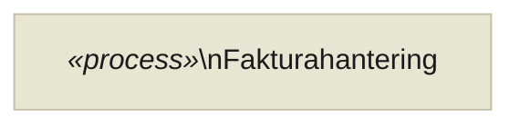

### Variant B: HTML-baserad kursiv, mindre och grå stereotyp

Använd denna variant när renderaren stöder HTML labels:

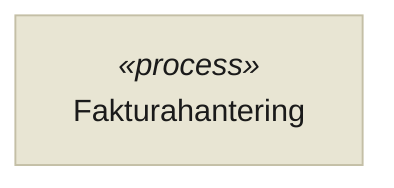

### Variant C: Portabel fallback

Använd denna när du vill vara säker på bred kompatibilitet:

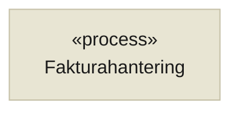

## Renderingsregel

När du genererar Mermaid med denna skill ska du välja etikettformat i följande ordning:

1. HTML-variant om miljön uttryckligen stöder `htmlLabels` och `securityLevel: loose`.
2. Markdown-variant om miljön stöder markdown strings men inte HTML labels.
3. Portabel fallback i alla andra fall.

## Exempel 1: Domänstaplat flowchart

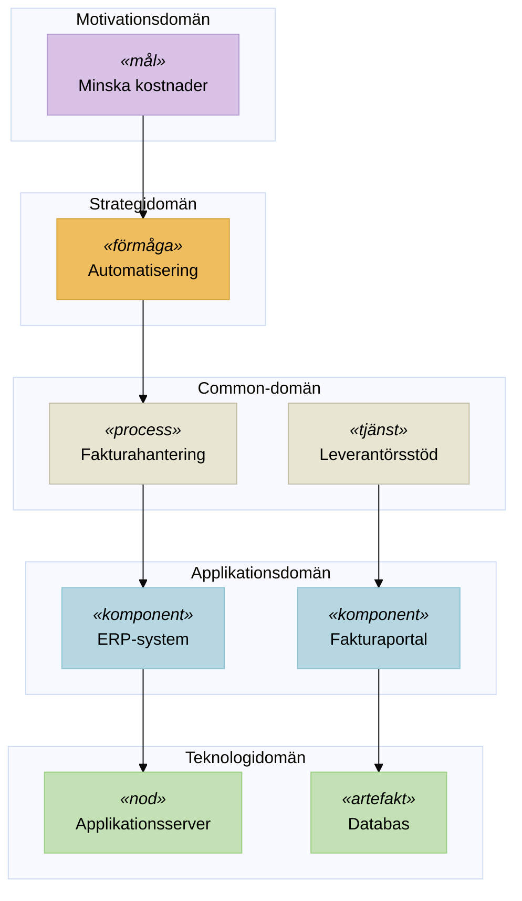

## Exempel 2: Förmågekarta

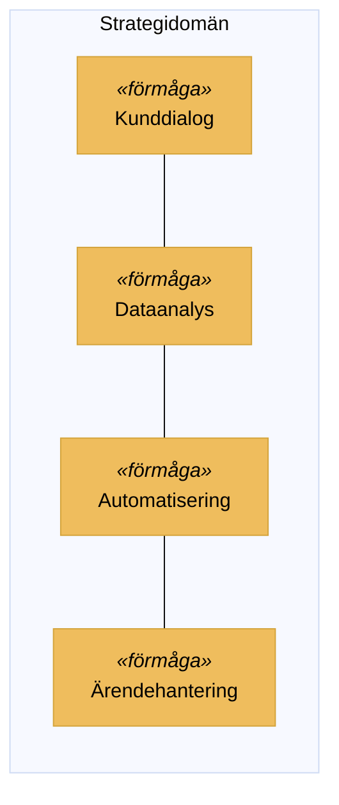

## Exempel 3: Värdeström

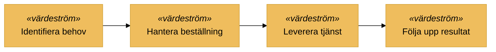

## Exempel 4: Sequence-diagram

I `sequenceDiagram` ska HTML och stereotyp inte användas. Visa i stället rena deltagarnamn.

### Exempel 4A: Sequence-diagram med tema

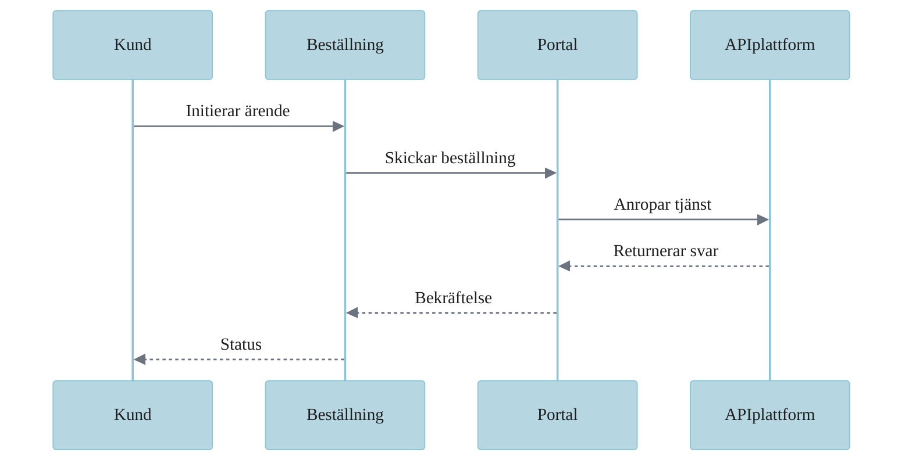

### Exempel 4B: Sequence-diagram med grupper

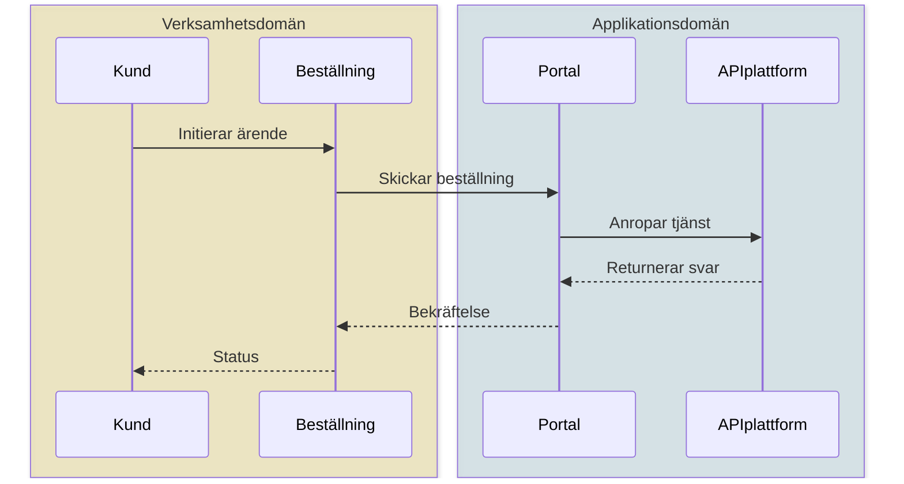

## Exempel 5: Gantt för migration

I `gantt` ska stereotyp inte visas. Använd endast aktivitetsnamn och milstolpar.

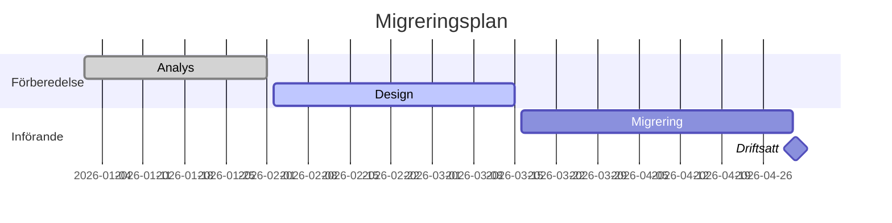

## Exempel 6: Mindmap

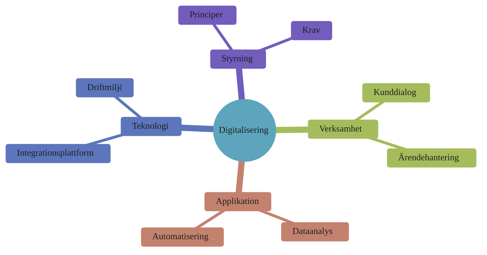

## Exempel 7: Timeline

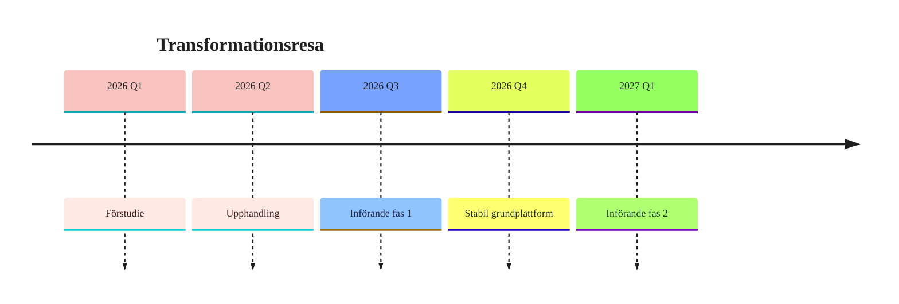

## Exempel 8: Ishikawa / fiskbensdiagram

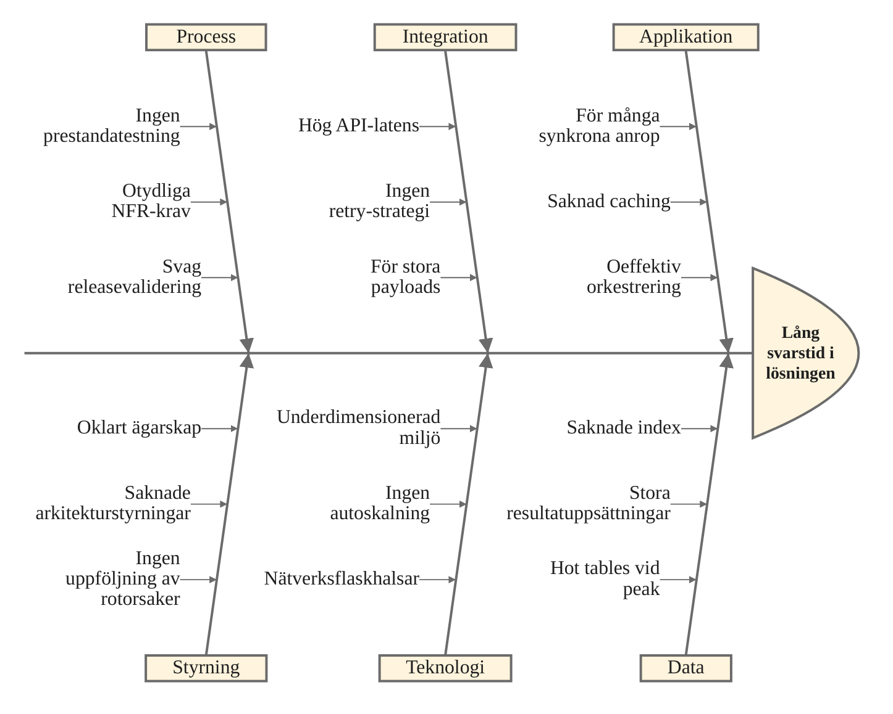

## Diagrammönster

### Förmågekarta

- använd Strategy-domänen
- använd `flowchart LR`
- gruppera närliggande förmågor i subgrafer
- använd helst HTML-variant för mindre grå kursiv stereotyp

### Systemlandskap

- använd Business, Application och Technology i vertikal ordning
- lägg gemensamma beteenden (process, tjänst) i Common-domänen
- använd subgrafer per domän
- koppla tjänster till komponenter och noder

### Migrationsplan

- använd Implementation & Migration för arbetspaket och platåer
- koppla gärna mot målarkitektur i Application- eller Technology-domänen

### Integrationsöversikt

- visa verksamhetstjänst (Business) över applikationskomponent (Application) över teknisk nod (Technology)
- använd tydlig uppifrån-och-ned-ordning

## HTML/CSS-komplement för dokumentation

```html
<div class="archimate-card archimate-card--common">
  <span class="archimate-stereotype">«process»</span>
  <span class="archimate-name">Fakturahantering</span>
</div>
```

```css
:root {
  --am-common: #E8E5D3;
  --am-common-stroke: #C4BFA6;
  --am-text: #1a1a1a;
  --am-stereotype: #555555;
}

.archimate-card {
  padding: 0.75rem 1rem;
  border-radius: 6px;
  border-left: 4px solid var(--am-common-stroke);
  background: var(--am-common);
  color: var(--am-text);
}

.archimate-stereotype {
  display: block;
  font-size: 0.75em;
  color: var(--am-stereotype);
  font-style: italic;
  line-height: 1.2;
  margin-bottom: 0.1rem;
}

.archimate-name {
  display: block;
  font-size: 1em;
  color: var(--am-text);
  font-weight: 600;
  line-height: 1.25;
}
```

## Genereringsinstruktioner

När denna skill används ska utdata:

- alltid välja svenska ArchiMate-termer
- alltid inkludera guillemets runt typen
- alltid sätta typen på egen rad ovanför namnet
- göra stereotypen kursiv där den används
- inte använda stereotyp i `sequenceDiagram`, `gantt` eller `timeline`
- använda Common-domänen (`#E8E5D3`) för generiska beteendeelement (process, funktion, tjänst, händelse)
- använda Technology-domänen (`#C3E1B4`) för fysiska element (utrustning, anläggning, material) — Physical Layer finns inte i AM4
- använda lagerfärger i `mindmap` baserat på respektive gren/domän
- alltid använda rätt klass för rätt domän
- alltid använda färger enligt tabellen ovan
- prioritera `flowchart` för klassiska ArchiMate-vyer
- kunna använda `sequenceDiagram`, `gantt`, `timeline`, `mindmap` och `ishikawa-beta` när syftet kräver det
- utgå från senaste Mermaid och tillåta beta-diagram där de är relevanta
- hålla `ishikawa-beta` enkelt när färgstöd eller detaljstyling är osäkert

## Referensinformation

- **Standard**: The Open Group ArchiMate 4, specifikation C260, april 2026
- **Färger**: ArchiMate 2025 Modern Color Set
- **Dokumentation**: [opengroup.org/archimate-forum](https://www.opengroup.org/archimate-forum)
- **Viktigaste AM4-förändring**: Physical Layer borttaget, Common-domän tillagd, "domäner" ersätter "lager"
