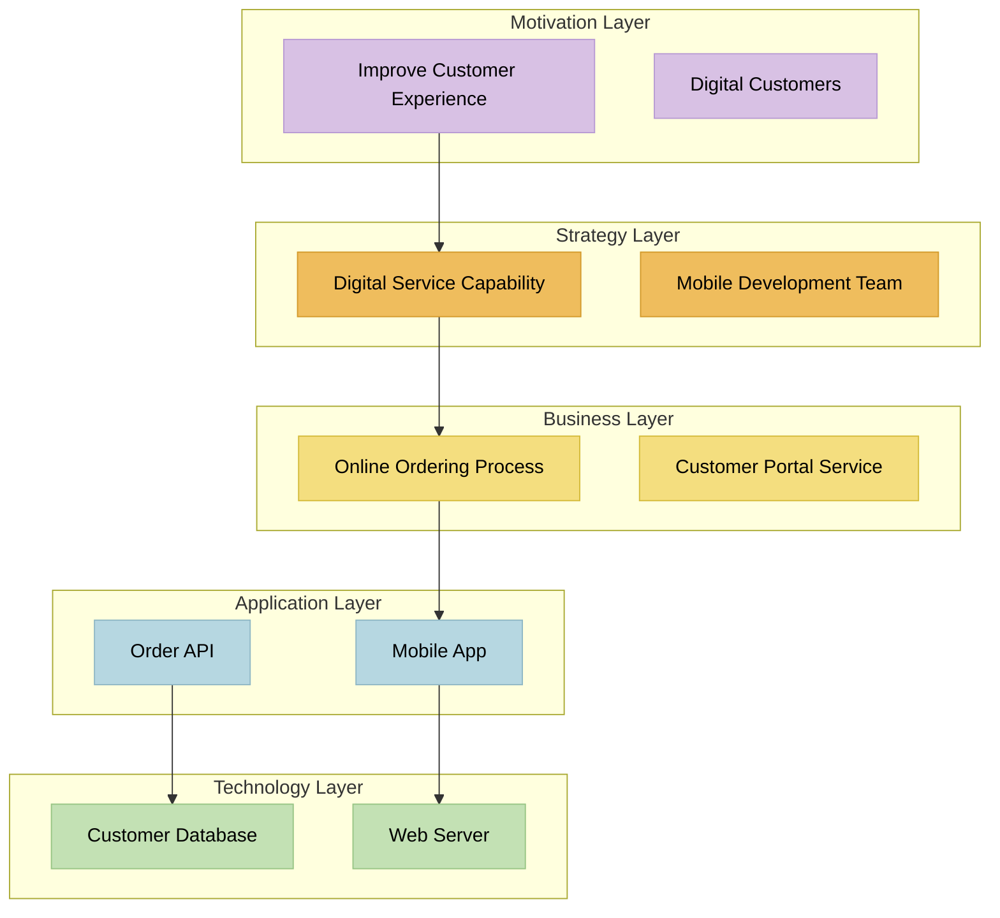

# ArchiMate 2025 Modern Color Set

ArchiMate 2025 introduces the new "Modern Color Set" with updated colors and the addition of Strategy Layer. This skill provides the complete reference for proper color usage, element classification, and modeling guidelines.

## Color Palette and Layer Hierarchy

Use this specific order when creating diagrams or documentation:

| Layer | Color Name | Hex Code | Purpose |
|-------|------------|----------|---------|
| **Motivation** | Languid Lavender | `#D8C1E4` | Goals, stakeholders, requirements that drive architecture |
| **Strategy** | Saffron Mango | `#EFBD5D` | Capabilities, resources, strategic direction |
| **Business** | Jasmine | `#F4DE7F` | Business processes, roles, services, products |
| **Application** | Pale Aqua | `#B6D7E1` | Application components, services, data objects |
| **Technology** | Fringy Flower | `#C3E1B4` | Hardware, infrastructure, system software |
| **Composite/Location** | Satin Linen | `#E8E5D3` | Physical locations, groupings |
| **Implementation & Migration** | Tea Rose | `#F8C2BE` | Work packages, deliverables, change projects |

## Elements by Layer

### Motivation Layer (#D8C1E4 - Languid Lavender)
**Elements:** Stakeholder, Driver, Assessment, Goal, Outcome, Principle, Requirement, Constraint, Meaning, Value

**Use for:** Business goals, stakeholder needs, compliance requirements, success criteria, design principles

**Examples:**
- Stakeholder: Customer, Business Owner, Regulator
- Goal: "Improve customer satisfaction by 25%"
- Requirement: "System must be available 99.9%"
- Driver: "New GDPR regulation"

### Strategy Layer (#EFBD5D - Saffron Mango)
**Elements:** Resource, Capability, Value Stream, Course of Action

**Use for:** Strategic capabilities, resource planning, value delivery, strategic initiatives

**Examples:**
- Capability: "Customer Service", "Data Analytics"
- Resource: "Customer Database", "Sales Team"
- Value Stream: "Order-to-Cash", "Hire-to-Retire"
- Course of Action: "Digital Transformation", "Cloud Migration"

### Business Layer (#F4DE7F - Jasmine)
**Elements:** Actor, Role, Collaboration, Interface, Process, Function, Interaction, Event, Service, Object, Contract, Representation, Product

**Use for:** Business processes, organizational structure, business services, business information

**Examples:**
- Actor: Sales Department, Customer
- Process: "Order Processing", "Invoice Management"
- Service: "Customer Support", "Online Banking"
- Object: Customer Data, Invoice
- Product: Insurance Policy, Software License

### Application Layer (#B6D7E1 - Pale Aqua)
**Elements:** Component, Collaboration, Interface, Function, Interaction, Process, Event, Service, Data Object

**Use for:** Software applications, application services, data structures, system interfaces

**Examples:**
- Component: "CRM System", "Payment Gateway"
- Service: "Authentication Service", "Reporting API"
- Data Object: Customer Record, Transaction Log
- Interface: REST API, Database Connection

### Technology Layer (#C3E1B4 - Fringy Flower)
**Elements:** Node, Device, System Software, Collaboration, Interface, Network, Communication Path, Service, Function, Artifact, Event

**Use for:** IT infrastructure, hardware, networks, system software, technical services

**Examples:**
- Node: Web Server, Database Server
- Device: Router, Firewall, Mobile Device
- Network: LAN, WAN, Internet
- Artifact: Configuration File, Database Schema
- System Software: Operating System, Middleware

### Composite/Location Layer (#E8E5D3 - Satin Linen)
**Elements:** Equipment, Facility, Distribution Network, Material

**Use for:** Physical locations, buildings, equipment, geographical distribution

**Examples:**
- Facility: Office Building, Data Center
- Equipment: Server Rack, Network Equipment
- Location: New York Office, Cloud Region

### Implementation & Migration Layer (#F8C2BE - Tea Rose)
**Elements:** Work Package, Deliverable, Implementation Event, Plateau, Gap

**Use for:** Project management, change initiatives, migration planning, implementation roadmaps

**Examples:**
- Work Package: "Database Migration", "User Training"
- Deliverable: System Documentation, Test Results
- Plateau: "Phase 1 Complete", "MVP Released"
- Gap: "Missing Integration", "Security Vulnerability"

## Mermaid Diagram Syntax

### CSS Classes for Mermaid

```css
classDef motivation fill:#D8C1E4;
classDef strategy fill:#EFBD5D;
classDef business fill:#F4DE7F;
classDef application fill:#B6D7E1;
classDef technology fill:#C3E1B4;
classDef composite fill:#E8E5D3;
classDef implementation fill:#F8C2BE;
```

### Example Mermaid Flowchart


## Usage Guidelines

### When to Use This Skill
- Creating ArchiMate diagrams and models
- Standardizing enterprise architecture documentation
- Building color-consistent visualization tools
- Generating architecture diagrams with proper layer representation
- Writing documentation that references ArchiMate elements

### Color Consistency Rules
1. **Always use exact hex codes** - No approximations
2. **Maintain layer hierarchy** - Motivation → Strategy → Business → Application → Technology → Composite → Implementation
3. **Use appropriate elements per layer** - Don't mix element types across layers
4. **Strategy Layer is mandatory** - New in 2025, bridge between Motivation and Business

### Element Selection Guide
- **Start with Motivation** for goals and requirements
- **Use Strategy** for capabilities and strategic initiatives  
- **Business Layer** for operational processes and services
- **Application Layer** for software systems and data
- **Technology Layer** for infrastructure and hardware
- **Composite/Location** for physical aspects and grouping
- **Implementation & Migration** for change and project elements

### Integration with Other Standards
- **TOGAF ADM**: Map phases to appropriate ArchiMate layers
- **BDAT**: Business→Business Layer, Data→Application Layer, Application→Application Layer, Technology→Technology Layer
- **COBIT**: Use Motivation layer for governance requirements
- **ITIL**: Map service components across Business and Application layers

## Reference Information
- **ArchiCode (this repo)**: `archicode.js` (`ARCHIMATE_COLORS`) and embedded icons in `archicode.css` implement these fill/stroke hex values for rendering and export.
- **Source**: The Open Group ArchiMate 2025 Modern Color Set
- **Official Document**: [ArchiMate 2025 Color Palette PDF](https://www.opengroup.org/sites/default/files/color-pallete-2025-archimate.pdf)
- **Standard Version**: 3.2+
- **Key Change**: Introduction of Strategy Layer between Motivation and Business layers